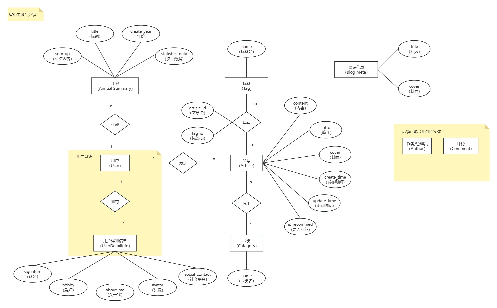

# Django博客后端项目（持续开发中）

## 开始运行

### 1. 安装依赖

```commandline
pip install -r requirements.txt
```

### 2. 迁移到数据库

```commandline
python manage.py makegrations
```

### 3. 运行项目

```commandline
python manage.py runserver
```
## 项目介绍

### 数据库ER图

